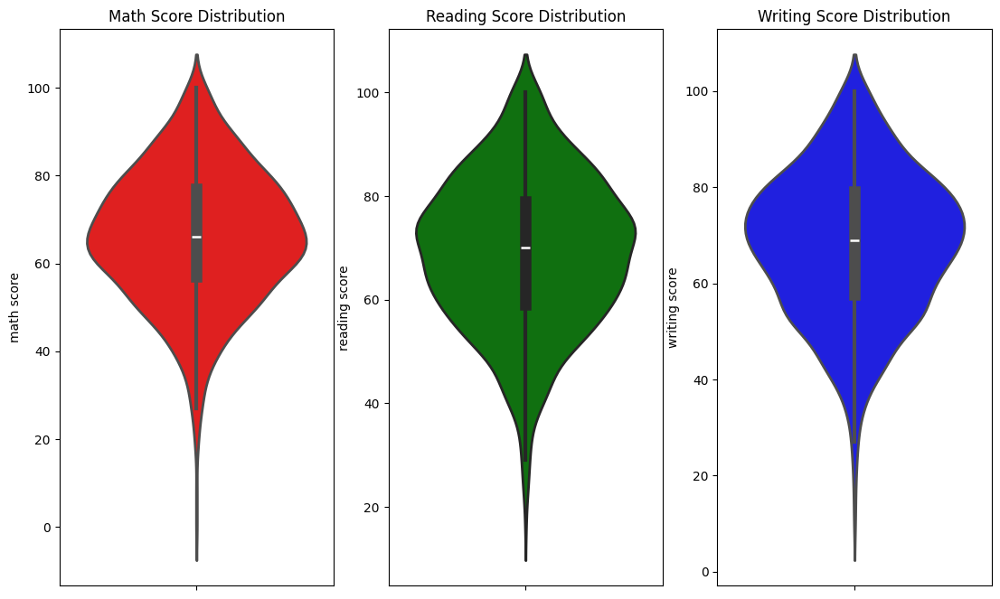
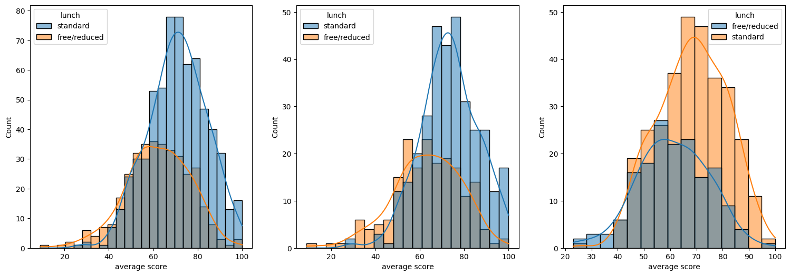
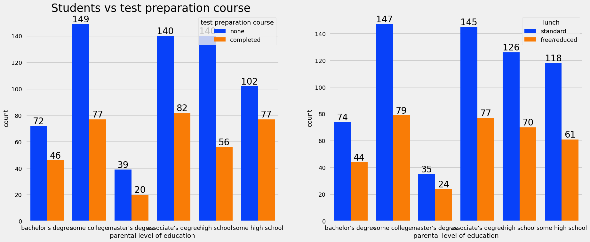
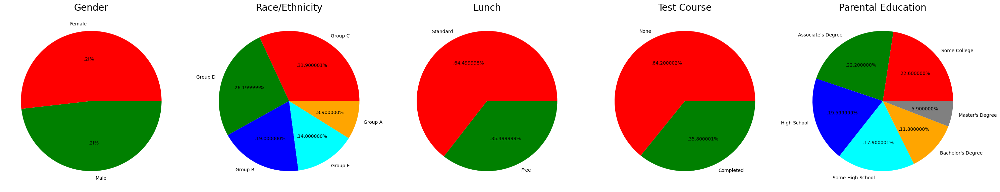

# Student Performance Analysis

## Overview

This project performs Exploratory Data Analysis (EDA) on a student performance dataset to identify factors affecting students' academic scores in Math, Reading, and Writing.

The analysis focuses on understanding relationships between demographic, parental, and lifestyle-related factors with student performance using statistical analysis and data visualizations.

---

## Objectives

* Perform data cleaning and preprocessing
* Understand dataset structure and feature distributions
* Conduct univariate, bivariate, and multivariate analysis
* Identify factors influencing student scores
* Generate meaningful insights using visualizations

---

## Tech Stack

* Python
* Pandas
* NumPy
* Matplotlib
* Seaborn
* Jupyter Notebook

---

## Dataset Features

The dataset contains information about:

* Gender
* Race/Ethnicity
* Parental level of education
* Lunch type
* Test preparation course
* Math score
* Reading score
* Writing score

---

## Analysis Performed

### Data Understanding

* Dataset inspection
* Data types analysis
* Statistical summary

### Data Cleaning

* Missing value checks
* Duplicate value checks

### Univariate Analysis

* Score distributions
* Category distributions

### Bivariate Analysis

* Gender vs scores
* Lunch type vs performance
* Test preparation impact

### Multivariate Analysis

* Correlation analysis
* Feature relationships

---

## Key Insights

* Female students performed better in reading and writing scores.
* Students who completed test preparation courses generally scored higher.
* Standard lunch students showed better academic performance overall.
* Student scores across subjects showed strong positive correlation.

---

## Visualizations

### Score Distribution



---

### Lunch Type vs Average Score



---

### Test Preparation Course Dependency



---

### Multivariate Analysis




## Future Improvements

* Build a machine learning model for score prediction
* Deploy an interactive dashboard using Streamlit or Power BI
* Perform advanced statistical analysis

---

## Project Structure

```bash
student-performance-analysis/
│
├── student_performance_analysis.ipynb
├── StudentsPerformance.csv
├── README.md
└── requirements.txt
```

---

## Author

Satyam Shaswat
